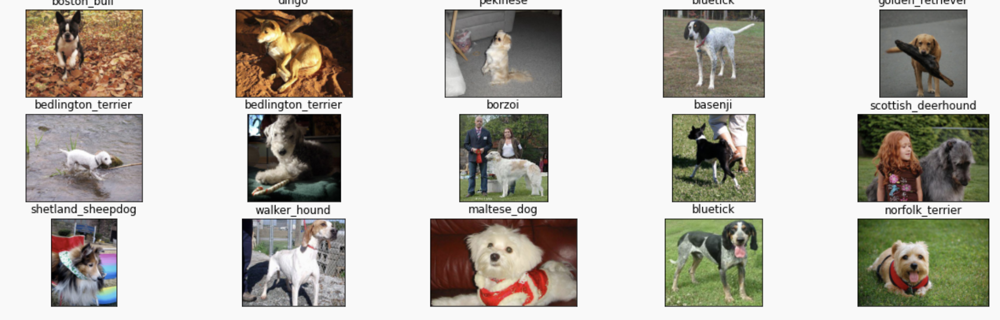
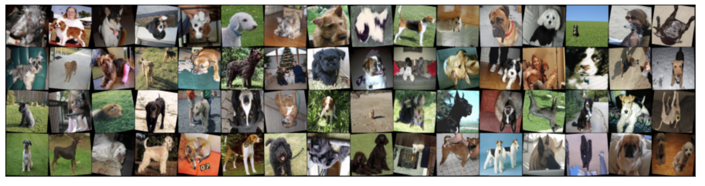
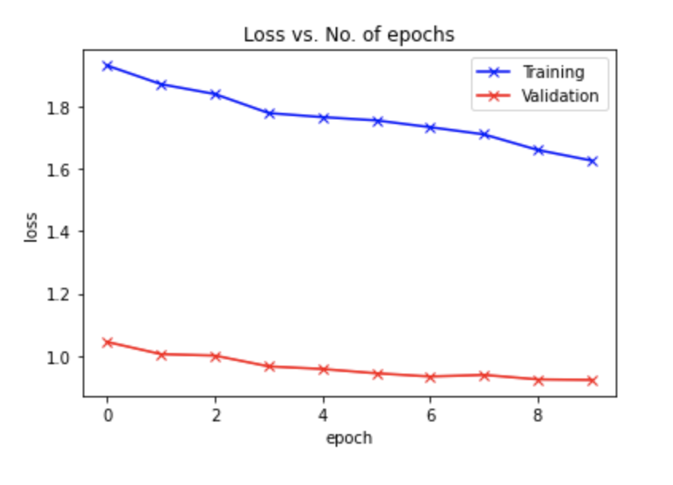

## Jovian.ML Course Final Project Blog (Author: J. Lim)

In this blog, I applied knowledges and techniques I learned from the course to develop and create an image classification model on Dog Breed Identification dataset. Also, this is my first attempt in creating my own blog, so it is rather not in well-polished format. Nonetheless, the experience was very beneficial, and looking to forward to publish my works whenver opportunities arise.

Dataset is obtained from Kaggle dataset repository URL link: [Dog-breed-identification](https://www.kaggle.com/c/dog-breed-identification/data)

A ResNet model was trained, and the notebook URL link: [ResNet-model-notebook](https://jovian.ml/jlim00/assignment-05)

### Dataset

Following is some sample images selected and displayed:

Followig is sample images with image augmentations applied (ColorJitter, Horizontal/Vertical Flip, and Rotation):

### Pre-trained Model

A pre-trained model, ResNet-18, was used in model training. The entire network excluding the output layer was unfreezed and trained for 10 epoches in 2 separate stages.

### The Results

The training and validation loss curve is produced and shown

At the end of epoch 20, with a trained model used on test dataset, it achieved an accuracy of 72.211%
